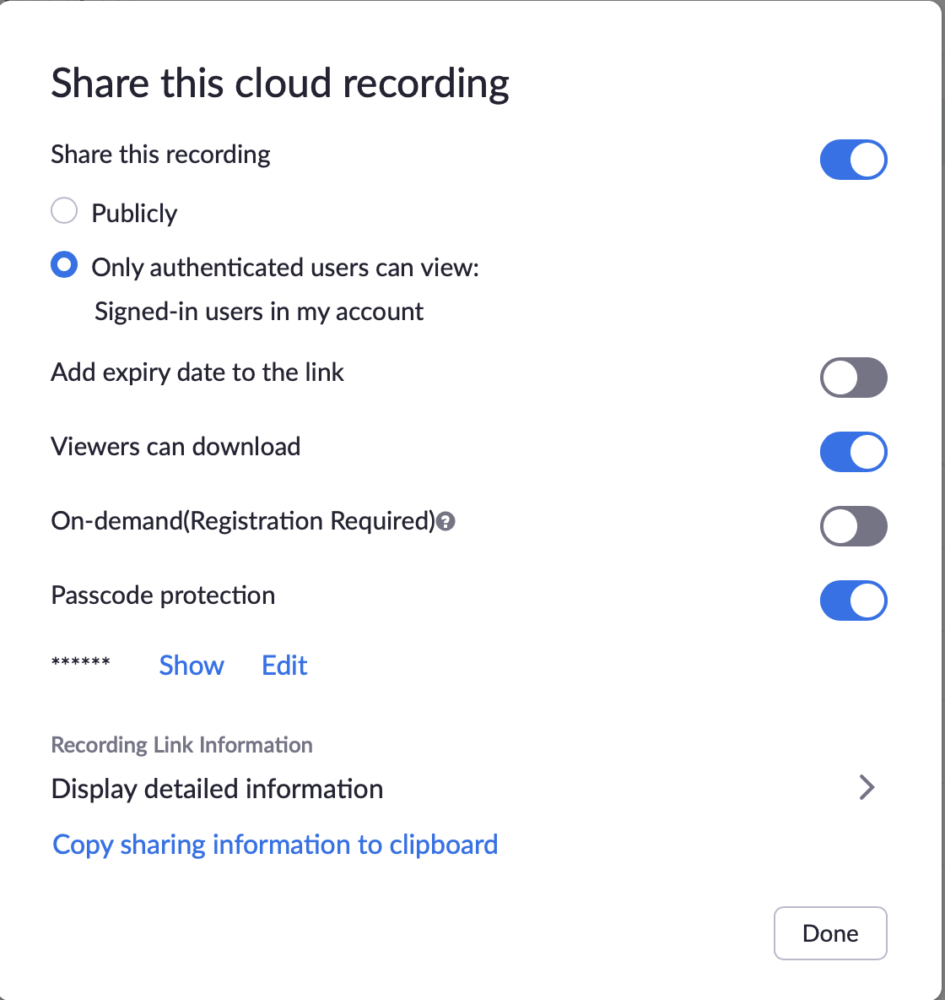

# Zoom Recordings
You have several options for recording your Zoom meetings.

1. Record all your meetings automatically to the cloud.
1. Record meetings manually to the cloud.
1. Record meetings manually to your computer.

## Which Option Is Best
The simplest option for most teachers is to have your meetings automatically stored to Zoom's cloud storage and then share those videos with your students. 

According to [this document](https://docs.google.com/document/d/1DaOioCx5Edrz96x0vKvFC-igXZ6BooQkD90CiLQyt-M/edit), your cloud recordings will be retained for "approximately 3 months." If that meets your needs, your best option is almost certianly to automatically record to the cloud and learn how to share the links with students.

## Zoom Recordings
Let's start by looking at the settings and learning about where your cloud recordings are stored.

### Settings

1. Visit [https://zoom.us/](https:/zoom.us)
1. Click _Sign In_
1. Click _Sign in with Google_

    
    

1. Click _Settings_ in the menu and then _Recordings_

    

1. You will now see a long list of options. The images below represent the default settings. Let's look at a few you might want to tweak.

    
    

#### A Note About _Auto delete_ 
If you're absolutely sure you only need your recordings for a certain number of days, go ahead and toggle that _Auto delete cloud recordings after days_ and set the number of days. 

If you're not sure, just leave that toggle off, but be aware that there is a maximum amount of storage and videos older than a certain number of days may be deleted if storage space is low. According to [this document](https://docs.google.com/document/d/1DaOioCx5Edrz96x0vKvFC-igXZ6BooQkD90CiLQyt-M/edit), your cloud recordings will be retained for "approximately 3 months." 

### Sharing and Managing Recordings
If you toggled on _Automatic recording_, you will not need to remember to record your meetings. 

If you prefer to start and stop recordings manually, we'll cover that in another tutorial.

In either case, you're next step is to learn how to share and manage them.

1. Click on _Recordings_ in the menu
1. Click on _Cloud Recordings_ near the top

    

    Note in the image above that one of the recordings is still processing even though it is not the newest recording. The longer the video, the longer the processing time. 

    Once a video is processed, it's ready to be shared with students. 

1. Click _Share_ 

    

    In my experience, the best option is to leave "Only authenticated users..." ON and to turn OFF "Passcode protection" but you might have more success with "Publicly" and "Passcode protecion."

1. Click _Copy sharing information to clipboard_
1. You can now _Paste_ that information wherever you need TowerNet. 

